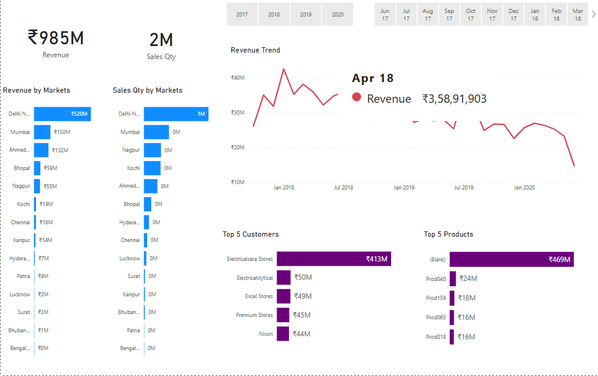
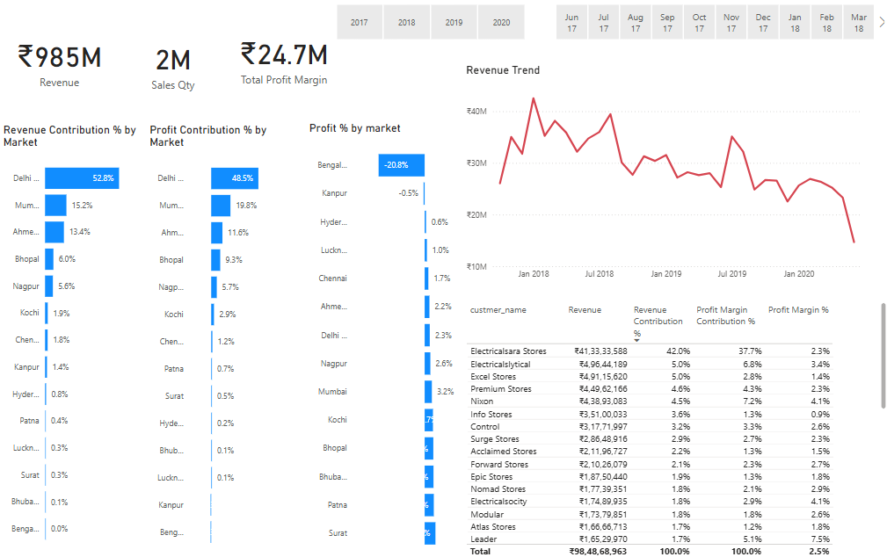
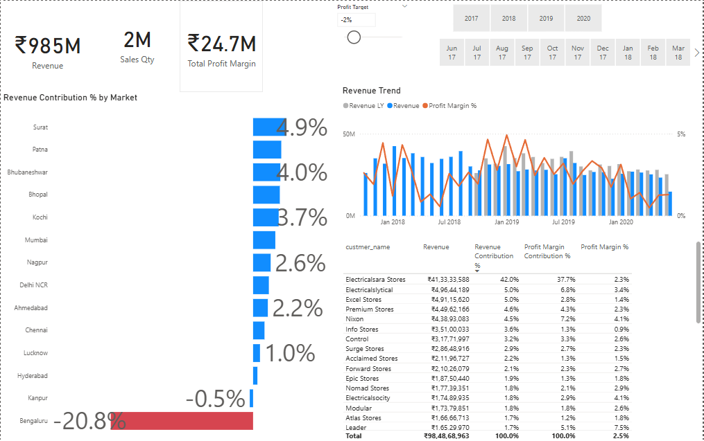

# Business-Sales-Performance-dashboard

## 1️⃣ Project Title  
**Business Performance Dashboard using Power BI**

---

## 2️⃣ Short Description  
This project is an interactive Power BI dashboard that visualizes key sales metrics across different markets, customers, and time periods. It enables business users to analyze trends, evaluate profitability, and identify high- and low-performing segments quickly and effectively.

---

## 3️⃣ Tech Stack  
- **Power BI Desktop**
- **DAX (Data Analysis Expressions)** for measures and calculated columns  
- **Power Query** for data transformation  
- **Custom Visuals**: KPI cards, combo charts, diverging bar charts, and tabular views  

---

## 4️⃣ Data Source  
- Sample retail sales dataset including:
  - Revenue  
  - Sales Quantity  
  - Profit Margin  
  - Market, Product, and Customer Dimensions  
  - Time Period: 2017–2020

---

## 5️⃣ Features and Highlights  

### 🧩 Business Problem  
Sales performance was inconsistent across regions, and leadership lacked visibility into profit-driving vs. loss-generating markets, customers, and products. There was no unified view for decision-makers to compare trends or set performance targets.

### 🎯 Why This Dashboard Was Built  
To solve the above problem by creating a centralized, easy-to-use, and interactive dashboard that highlights:
- Which **markets** are performing well or underperforming  
- Who the **top customers and products** are  
- How **profit margins** behave over time and location  
- Where revenue losses are occurring and why

---

### ✅ Key Features  

#### 📌 KPIs  
- Total Revenue  
- Total Sales Quantity  
- Total Profit Margin  

#### 📈 Page 1: Overall Sales Summary  
- **Cards Used**: KPI Cards for Revenue & Sales Qty  
- **Visuals**:  
  - Bar charts for Revenue/Sales by Market  
  - Line chart for Revenue Trend  
  - Bar cards for Top 5 Customers & Products  
  - Time filters (Year, Month)

#### 📊 Page 2: Contribution Analysis  
- **Cards Used**: KPI Cards for Revenue, Sales, and Profit Margin  
- **Visuals**:  
  - Stacked bar charts for Revenue and Profit % by Market  
  - Diverging bar chart for Profit % by Market  
  - Line chart for Revenue Trend  
  - Tabular matrix with contribution and profit margins

#### 📉 Page 3: Market Risk & Recovery  
- **Cards Used**: KPI Cards for Revenue, Sales Qty, and Profit Margin  
- **Visuals**:  
  - Revenue Contribution % bar chart (with negatives in red)  
  - Combo chart (Revenue LY, Revenue, Profit Margin %)  
  - Customer-level contribution matrix  
  - Profit Target Indicator (Slider)

---

## 6️⃣ Screenshots  

### 🔹 Page 1 – Sales Summary  

### 🔹 Page 2 – Contribution Analysis  

### 🔹 Page 3 – Market Risk & Recovery  

---

> 📁 *Note: Please place your screenshots in a folder named `screenshots/` within your repo for these links to work.*
